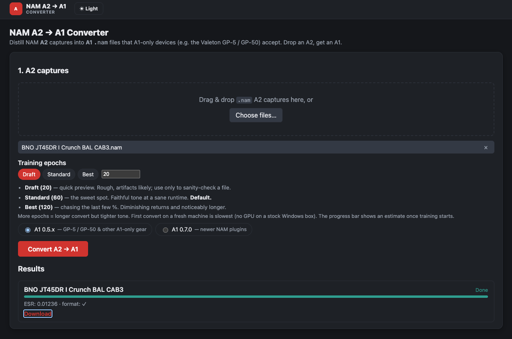

# NAM A2 → A1 Converter

Distill **NAM A2** captures into **A1** `.nam` files, for devices and plugins that
only accept A1 — like the **Valeton GP-5 / GP-50**.

A2 and A1 are different neural architectures; their weights don't transfer. So this
doesn't "downgrade" — it **distills**: render a standardized DI through the A2 model,
then train an A1 to reproduce that output.

```
A2.nam ──render DI──▶ teacher.wav ──train an A1 to match──▶ A1.nam ──▶ your A1-only device
```

Because the A2 teacher is deterministic and noise-free, the A1 copy is typically a
*tighter* match to the A2 than a real-amp capture is to its amp.



## Download

Latest desktop build — no Python, no setup:

- **macOS** — [**nam-a2a1-converter-macos.dmg**](https://github.com/drewmerc302/nam-a2a1-converter/releases/latest/download/nam-a2a1-converter-macos.dmg)
  — signed + notarized, opens clean.
- **Windows** — [**nam-a2a1-converter-windows.zip**](https://github.com/drewmerc302/nam-a2a1-converter/releases/latest/download/nam-a2a1-converter-windows.zip)
  — unzip, run `nam-a2a1-converter.exe`. It's **unsigned**, so SmartScreen warns:
  click **More info → Run anyway**. Some antivirus may flag PyInstaller apps — false positive.
- **Linux (x86_64)** — [**nam-a2a1-converter-linux-x86_64.tar.gz**](https://github.com/drewmerc302/nam-a2a1-converter/releases/latest/download/nam-a2a1-converter-linux-x86_64.tar.gz)
  — extract and run from a terminal:

  ```bash
  tar -xzf nam-a2a1-converter-linux-x86_64.tar.gz
  ./nam-a2a1-converter/nam-a2a1-converter      # opens your browser; Ctrl+C to quit
  ```

  Built against **glibc 2.35**, so it runs on Ubuntu 22.04+, Debian 12+, Mint 21+,
  Pop!\_OS 22.04+, Fedora 36+, Arch, and openSUSE 15.5+. Older distros (Ubuntu 20.04,
  Debian 11, RHEL 9) will fail at launch with `GLIBC_2.35 not found` — [run from
  source](#run-from-source) instead. **glibc is the only thing it needs from your
  system** — Tcl/Tk and the X11 client libs are bundled, so there are no packages to
  install. If the browser doesn't open by itself, the terminal prints the URL.

All releases: [github.com/drewmerc302/nam-a2a1-converter/releases](https://github.com/drewmerc302/nam-a2a1-converter/releases)

## Using it

1. **Launch** the app — it opens a converter page in your browser.
2. **Drop** one or more A2 `.nam` captures (or **Choose files**). Batches convert one after another.
3. Pick a **quality preset** (Draft / Standard / Best) and hit **Convert A2 → A1**.
4. Watch the live **progress bar + ETA**; **Cancel** anytime.
5. **Download** each result — A1 `.nam` files also land in `~/NAM-A2A1-out/`.
6. Load the A1 `.nam` on your device — e.g. import into **Valeton Suite**, which converts
   it to a SnapTone and pushes it to the pedal.

**First convert is slowest** on a machine with no GPU (CPU training — a few minutes at
Standard). The ETA tells you how long is left.

## Quality presets

| Preset | Epochs | Use |
|--------|--------|-----|
| Draft  | 20     | Quick preview — rough, sanity-check only. |
| Standard | 60   | The sweet spot. Faithful tone, sane runtime. **Default.** |
| Best   | 120    | Chasing the last few %. Diminishing returns, longer. |

## Run from source

```bash
python3 -m venv .venv
./.venv/bin/pip install -r requirements.txt
./.venv/bin/python -m nam_a2a1            # opens the web UI in your browser
```

Or headless / batch on the CLI:

```bash
# one file, end to end (render + train + transcode)
./.venv/bin/python -m nam_a2a1 render capture.nam refs/v3_0_0.wav /tmp/y.wav
./.venv/bin/python -m nam_a2a1 train  refs/v3_0_0.wav /tmp/y.wav /tmp/out --epochs 60 --format 0.5x
```

## How it works (one venv, no format juggling)

The whole pipeline runs on **NAM 0.13.0**. 0.13.0 loads A2 and trains A1, but exports
the 0.7.0 `.nam` format; A1-only devices want **0.5.x**. For a standard WaveNet the two
formats differ *only* in their config schema — the weight array is byte-identical — so
`nam_a2a1/pipeline/nam_transcode.py` reshapes the config in pure Python, no torch, no
retraining. That removed the second (0.12.2) environment the pipeline used to need.

## Build the installers yourself

```bash
pip install -r requirements.txt pyinstaller
pyinstaller --noconfirm build/nam-a2a1-converter.spec
# dist/nam-a2a1-converter/  → the frozen onedir app
```

CI (`.github/workflows/build-desktop.yml`) builds both platforms on a `v*` tag and
attaches them to the Release. macOS signing/notarization needs these repo secrets:
`MACOS_CERT_P12_BASE64`, `MACOS_CERT_PASSWORD`, `MACOS_KEYCHAIN_PASSWORD`,
`APPLE_TEAM_ID`, `APPLE_API_KEY_ID`, `APPLE_API_ISSUER_ID`, `APPLE_API_KEY_P8_BASE64`.
Without them the macOS build is produced unsigned. Windows is always unsigned.

## Credits

Built on [Neural Amp Modeler](https://github.com/sdatkinson/neural-amp-modeler) (MIT).
0.5.x-format insight from [`arturksd/NAM-A1-local-trainer`](https://github.com/arturksd/NAM-A1-local-trainer).
